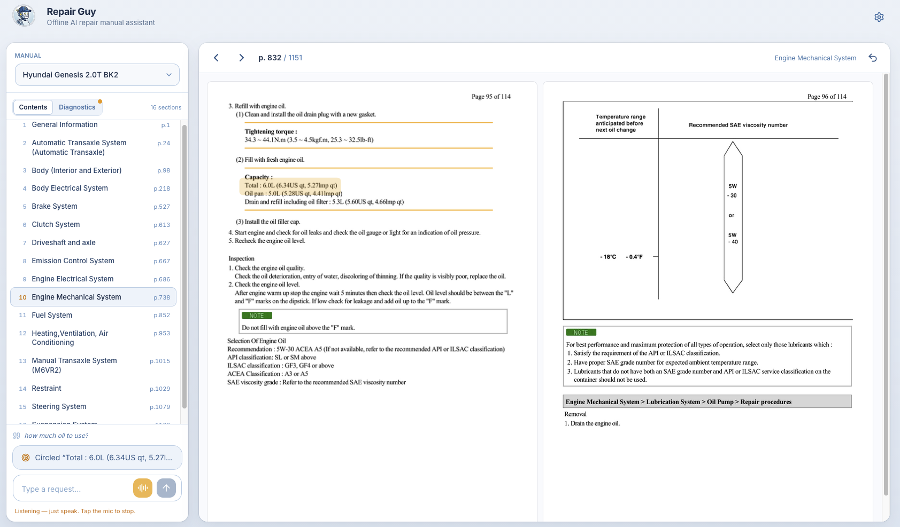

# Repair Guy: Hands-Free Manual Navigator

  

**▶️ [Watch the Demo Video](https://www.youtube.com/watch?v=PFUOHoVQUsI)**  
**🐦 [Social Media Post](https://www.linkedin.com/posts/ray-martinez1_i-spent-the-past-week-working-on-the-build-ugcPost-7472117118377918464-X7Bb/?utm_source=share&utm_medium=member_desktop&rcm=ACoAAB255oEBSd0o7PIGG3mbO4BhG43UTxgV0u0)**  
**📝 [Read the Field Notes Blog Post](https://raymartinez.dev/blog/repair-guy-field-notes/)**

## 💡 The Problem & Solution
Mechanics with greasy hands can't scroll through 500-page PDFs. **Repair Guy** is a fully local, voice-activated manual navigator. 
It visually highlights exact diagrams and troubleshooting steps, and allows for precise page navigation, all hands-free.

## ⚙️ The Tech Stack (All <32B Parameters)
*   **Agent Model:** `openbmb/MiniCPM4.1-8B` (8B) - Handles core logic. *(A ~1B brain is on the roadmap for on-device use.)*
*   **Vision Model:** `openbmb/MiniCPM-V-4_5` (9B) - Handles visual reasoning, component pinpointing, and generating table/image descriptions. *(A smaller VLM is on the roadmap for on-device use.)*
*   **Parsing Model:** `nvidia/NVIDIA-Nemotron-Parse-v1.2` (0.9B) - Turns dense Toyota Forklift and Hyundai Genesis manual pages into structured elements (sections, tables, figures with bounding boxes) that feed the text-parsed index. *(Runs only in the cloud indexing pipeline.)*
*   **Embedding Model:** `nvidia/llama-nemotron-embed-vl-1b-v2` (1B) - Produces the dense chunk/query embeddings used for retrieval over the parsed manuals.
*   **Speech Model:** `moonshine/tiny` (27M) - Runs directly in-browser for ultra-fast, real-time Speech-to-Text.
*   **Infrastructure:** `Modal` - Powers the batch indexing pipeline and automated model evaluations. *(Note: Indexing was offloaded to the cloud as a time-saving measure and to prevent heavy battery drain on edge devices).*
*   **Observability:** `Langfuse/In App` - Stores agent execution traces (for future finetuning) and app displays a diagnostic tab.

## 🎛 Other Features (mostly for engineers that want to experiment)
*   **Speak Responses:** Toggle voice readouts for true hands-free feedback 
*   **Careful Pointing:** Forces the VLM to reason before circling components, increasing accuracy on complex diagrams. (Increased latency but, if used with speak responses, you can get a ping when it's done)
*   **Dynamic Indices:** Swap between text-parsed indexing (best for specs/tables) and visual ColEmbed indexing (best for diagrams) for fun to see the difference ;)
*   **Model Swapping:** Swap between different models for the agent brain
*   **VRAM Logging:** Built-in logging to monitor GPU memory during model load/evict cycles.

## 🏆 Bonus Quests Achieved
*   **Off the Grid:** 100% local execution. Zero external cloud APIs used.
*   **Off-Brand:** Custom frontend architecture using `gr.Server`.
*   **Sharing is Caring:** Built-in UI Diagnostic Tab and Langfuse integration for agent traces.
*   **Field Notes:** Detailed write-up covering the architecture.

## 🚀 How to Test It
1. Select the **Toyota Forklift** or **Hyundai Genesis** manual.
2. Click the audio stream or type a message.
3. Use commands like: 
   * *"Show me the oil change procedure"*
   * *"Troubleshoot slipping clutch"*
   * *"Go to the next page"* / *"Go back a page"*
   * *"Go to page 512"*
